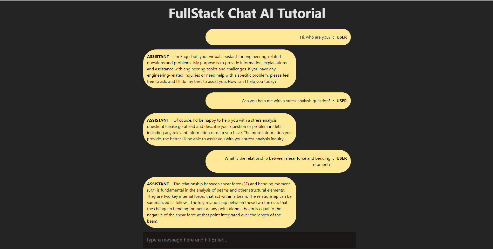

# Engg-bot


## Description
Engg-bot is a powerful engineering chatbot designed to assist you with all your engineering-related questions. Whether you're a student, a professional engineer, or simply curious about engineering topics, Engg-bot is here to provide you with accurate and reliable information. Powered by OpenAI's state-of-the-art language model, Engg-bot can answer a wide range of engineering questions and help you navigate the complex world of engineering.

### Features
- **Natural Language Understanding**: Engg-bot understands natural language queries, making it easy for you to ask questions in plain English without needing to use technical jargon.
- **Real-time Responses**: Engg-bot provides instant responses to your queries, ensuring that you get the information you need quickly.
- **OpenAI Backend**: Powered by OpenAI's advanced language model, Engg-bot leverages the latest advancements in natural language processing to deliver high-quality responses.
- **User-Friendly Frontend**: Engg-bot's frontend is built using ReactJS and Vite.js, ensuring a smooth and responsive user experience on both desktop and mobile devices.

# Requirements
- [**Node.js**](https://nodejs.org/): Version 18.x or higher.
- [**OpenAI**](https://platform.openai.com/): An Organization-key and a API-key is required.
- [**React.js**](https://react.dev/)
- [**Vite.js**](https://vitejs.dev/)

# Getting Started
1. Clone this repo: ```git clone https://github.com/Aakash1417/Engg-bot```
2. Navigate into the Brain folder: ```cd Engg-bot/Brain/```
3. Install the dependencies ```npm install```
4. Replace the ```organization``` and ```apiKey``` with your values in the ```index.js``` file
5. Run the Brain with ```node index```

_That will start the backend server on port ```8000```: <http://localhost:8000>_

6. Navigate into the Client folder: ```cd ../Client/```
7. Install the dependencies ```npm install```
8. Start the local server ```npm run dev```

_That will open the project on your default browser: <http://localhost:5173/>. You can now chat with the AI from your default browser_

## License
This project is NOT licensed. [Learn more](LICENSE).

## Ackno